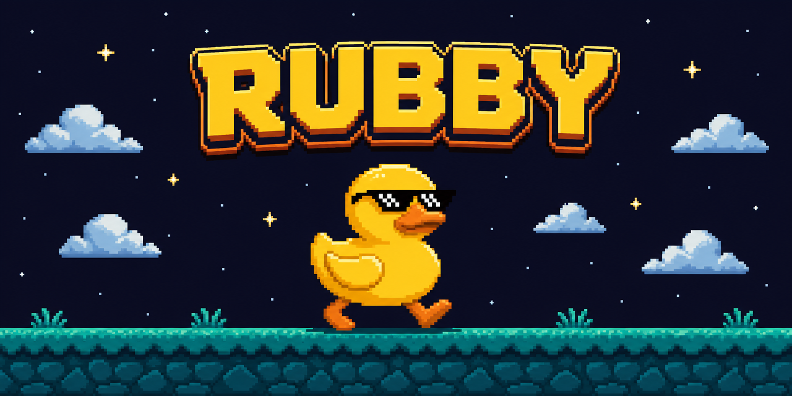
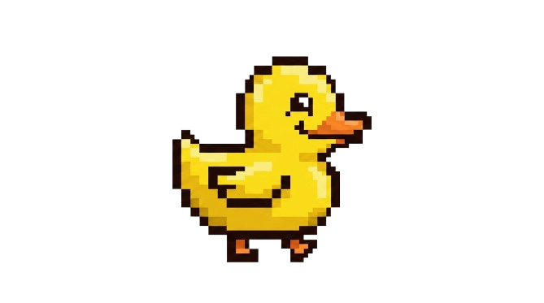
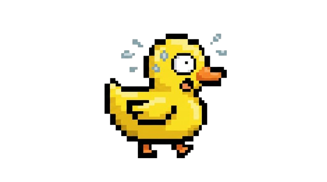
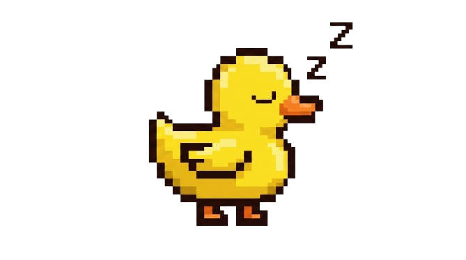

<div align="center">



# 🦆 Rubby

### *Your pixel-art coding companion.*

**Rubby lives in your VS Code sidebar and reacts to the health of your code.**
No popups. No notifications. Just a little duck who cares.

<br>

[](https://code.visualstudio.com/)
[](./LICENSE)
[](#)

<br>

```text
      __
   <(o )___
    ( ._>  /
     `---'

Quack quack! Happy coding!
```

</div>

---

## 📖 Table of Contents

<table>
<tr>
<td>

- [✨ Features](#-features)
- [🦆 States at a Glance](#-states-at-a-glance)
- [🚀 Installation](#-installation)
- [💡 Usage](#-usage)

</td>
<td>

- [⚙️ Settings](#️-settings)
- [🎮 Commands](#-commands)
- [🛠️ Development](#️-development)
- [🤝 Contributing](#-contributing)

</td>
</tr>
</table>

---

## ✨ Features

> *A lighthearted, pixel-art duck companion that reacts to the health of your code.*

<table>
<tr>
<td width="50%">

### 🐛 Error-Reactive States
Rubby watches your diagnostics. He walks happily by default — but if errors pile up, he'll look sad, or even panic!

### 💤 Sleep Mode
Step away for a while and Rubby dozes off to save energy. Touch a keyboard and he wakes right up.

### 💬 Idle Chat
When your code is clean, Rubby occasionally cracks a duck-themed dev joke to keep the vibes flowing.

</td>
<td width="50%">

### 👆 Click-to-Speak
Poke Rubby anytime to hear what he thinks about your current code state.

### 😎 The "Clean Run" Reward
Hit **F5** with zero errors and Rubby throws on his shades to celebrate.

### 🎛️ Configurable
Full control over thresholds, sleep timers, and personality quirks.

</td>
</tr>
</table>

---

## 🦆 States at a Glance

<div align="center">

| State | Sprite | Trigger |
| :--- | :---: | :--- |
| **Walking** |  | 1 – 10 errors. Some bugs, but manageable. |
| **Happy** |  | 0 errors. Transitioning back to a clean state. |
| **Sad** |  | > 10 errors (configurable). Things are piling up. |
| **Scared** |  | > 30 errors (configurable). Too many to handle! |
| **Sleeping** |  | 5 min of inactivity (configurable). |
| **Cool** |  | Press F5 with exactly 0 errors. |
| **Laughing** |  | Randomly every 1–2 min while walking cleanly. |

</div>

---

## 🚀 Installation

> 💡 *Not yet on the VS Code Marketplace? Build and install him locally!*

```bash
# 1. Clone the repo
git clone https://github.com/yourusername/rubby.git
cd rubby

# 2. Install dependencies
npm install

# 3. Package the extension
npx @vscode/vsce package
```

Then inside VS Code:

**`Ctrl+Shift+X`** → click the `⋯` menu → **Install from VSIX...** → pick the generated `.vsix`

🎉 **Done!** Rubby is now living in your sidebar.

---

## 💡 Usage

<table>
<tr>
<td>1️⃣</td>
<td>Open the <b>Rubby</b> panel in your sidebar — look for the duck icon 🦆</td>
</tr>
<tr>
<td>2️⃣</td>
<td>Start coding — Rubby automatically tracks errors and reacts in real-time</td>
</tr>
<tr>
<td>3️⃣</td>
<td>Click on Rubby anytime for a contextual message about your code state</td>
</tr>
<tr>
<td>4️⃣</td>
<td>Keep your code clean, press <b>F5</b>, and watch the shades come on 😎</td>
</tr>
</table>

---

## ⚙️ Settings

Customize Rubby via `settings.json` or run **`Rubby: Configure Thresholds`**.

| Setting | Type | Default | Description |
|:---|:---:|:---:|:---|
| `rubby.sadThreshold` | `number` | `10` | Errors before Rubby gets sad 😢 |
| `rubby.scaredThreshold` | `number` | `30` | Errors before Rubby panics 😱 |
| `rubby.idleSleepMinutes` | `number` | `5` | Minutes of inactivity before sleep 💤 |

---

## 🎮 Commands

| Command | Title | Purpose |
|:---|:---|:---|
| `rubby.configureThresholds` | **Rubby: Configure Thresholds** | Opens Settings filtered to Rubby |
| `rubby.talk` | **Rubby: Talk to the Duck** | Trigger click-to-speak programmatically |

> 🧪 *Internal dev commands: `rubby.testHappy`, `rubby.testSad`, `rubby.testScared`*

---

## 🛠️ Development

Want to tweak Rubby or add new sprites?

```bash
git clone https://github.com/yourusername/rubby.git
cd rubby
npm install          # 📦 install deps
npm run watch        # 👀 TypeScript watch mode
# then press F5 in VS Code to launch the Extension Dev Host
npm run lint         # 🧹 lint
npm test             # ✅ run tests
```

---

## 🤝 Contributing

Got a new sprite idea? A better joke? A wild feature?
We'd love to see it — check out [**CONTRIBUTING.md**](./CONTRIBUTING.md) to get started.

<div align="center">

**🎨 Sprites** · **😂 Jokes** · **🚀 Features** · **🐛 Bug Fixes**

*All contributions welcome!*

</div>

---

## 📄 License

<div align="center">

Released under the [**MIT License**](./LICENSE)

<br>

**Thank you for your time and make good use of Rubby**

<sub>⭐ Star the repo if Rubby made you smile!</sub>

</div>
